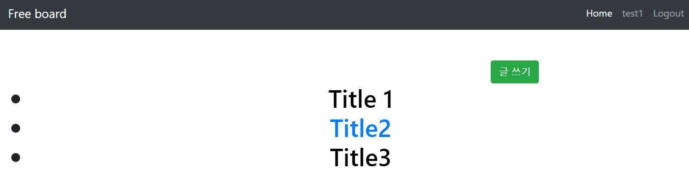
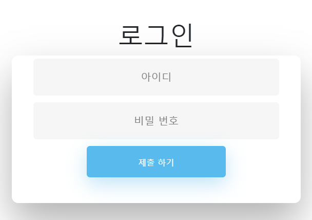
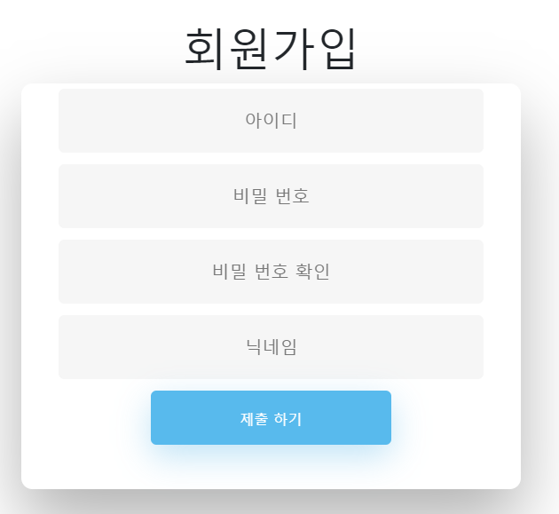

# Nodejs기반 게시판

</img>
HTML, CSS, Javascript, Nodejs, MySQL

## 기능

- ### 로그인

  </img>
  로그인 버튼을 눌러 로그인 페이지로 이동한 후 아이디, 비밀번호를 입력하고 제출한다.
  데이터베이스에서 해당 아이디, 비밀번호가 맞는지 확인 한 후 틀리면 에러페이지로 이
  동하고 맞으면 메인 페이지로 이동한다.

- ### 회원가입

  </img>
  새로운 계정을 만들기 위해서 회원가입 버튼을 눌러 회원가입 페이지로 이동한 후, 아이
  디, 비밀번호를 입력한다. 해당 아이디와 비밀번호가 양식에 맞는지 확인한 후 맞으면 데
  이터베이스에 새로운 계정을 생성한다. 이제 해당 계정으로 로그인이 가능하다.

- ### 글 읽기

  </img>
  게시글의 제목을 클릭하면 글의 내용을 보여주는 상세페이지로 이동하게 된다.

- ### 글 쓰기

  </img>
  글 쓰기 버튼을 누르면 글을 작성할 수 있는 페이지로 이동한다. 게시물 하나는 제목, 내
  용으로 구성된다.

- ### 글 수정

  </img>
  작성 되어있는 글에서 수정 버튼을 누르면 수정 페이지로 이동한다.

- ### 글 삭제
  </img>
  글을 작성한 사람이 자신의 글 페이지로 들어가 삭제 버튼을 누르면 게시글이 삭제된다.
  해당 사진은 제목 “Title 3”라는 글이 삭제된 모습이다.

## 데이터 베이스 테이블 구조

### DB 생성

    create database nodejs_board;

### 유저 테이블 생성

    CREATE TABLE `user_list` (
    `id` char(20) NOT NULL,
    `pw` text(200) NOT NULL,
    `salt` text(200) NOT NULL,
    `nickname` char(20) NOT NULL,
    PRIMARY KEY (`id`)
    ) ENGINE=InnoDB DEFAULT CHARSET=utf8;

### 글 목록 테이블 생성

    CREATE TABLE `writing_list` (
    `title` char(20) NOT NULL,
    `description` text(200) NOT NULL,
    `writer` char(200) NOT NULL
    ) ENGINE=InnoDB DEFAULT CHARSET=utf8;
